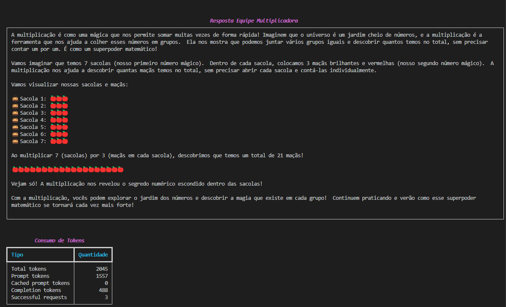

# Equipe Multiplicadora  <!-- omit in toc -->

Este projeto é parte do meu estudo sobre agentes inteligentes e suas aplicações práticas utilizando o **CrewAI**. Ele reflete minha evolução no tema, desde o aprendizado teórico até a implementação de uma equipe de agentes autônomos com funcionalidades específicas.  

O exemplo foi apresentado no livro *Agentes Inteligentes 2 - CrewAI Intermediário*, do [Professor Sandeco](https://www.youtube.com/@canalsandeco), e tem como objetivo demonstrar como agentes podem colaborar com ferramentas para alcançar resultados eficientes e didáticos.

- [Objetivo](#objetivo)
- [Sobre o CrewAI](#sobre-o-crewai)
- [Estrutura do Projeto](#estrutura-do-projeto)
  - [Exemplo de Configuração](#exemplo-de-configuração)
- [Execute Você Mesmo](#execute-você-mesmo)
  - [Pré-requisitos](#pré-requisitos)
  - [Passo 1: Clone o Repositório](#passo-1-clone-o-repositório)
  - [Passo 2: Configure o Ambiente](#passo-2-configure-o-ambiente)
  - [Passo 3: Execute a Equipe](#passo-3-execute-a-equipe)
- [Resultado](#resultado)
- [Próximos Passos](#próximos-passos)

## Objetivo  

Explorar as capacidades do **CrewAI** para:

- Criar agentes com personalidades e objetivos definidos.  
- Integrar ferramentas personalizadas para executar tarefas específicas.  
- Aprimorar a apresentação dos resultados utilizando o framework **Rich** para uma interface mais agradável no terminal.  

Este projeto combina criatividade com técnica para aplicar conceitos teóricos em um cenário prático.  

## Sobre o CrewAI  

O **CrewAI** é um framework avançado que facilita a criação de equipes de agentes autônomos que podem:  

- Desempenhar papéis específicos em fluxos de trabalho.  
- Tomar decisões com base no contexto e nas ferramentas disponíveis.  
- Colaborar para resolver problemas e alcançar objetivos.  

Com funcionalidades como **Agents**, **Tasks**, **Tools**, e **Processes**, o CrewAI é ideal para experimentos em agentes inteligentes. Saiba mais na [documentação oficial](https://docs.crewai.com/introduction).  

## Estrutura do Projeto  

O projeto implementa:  

1. **Agente Multiplicador:** Um "Filósofo Matemático Infantil" que transforma conceitos de multiplicação em lições filosóficas e exemplos ilustrativos.  
2. **Tarefa:** Um fluxo que orienta o agente a explicar a multiplicação e apresentar os resultados com sacolas e maçãs, tornando a experiência visual e cativante.  
3. **Ferramenta Personalizada:** Uma ferramenta que realiza multiplicações e apresenta os resultados.  

### Exemplo de Configuração  

**Configuração do Agente:**  

```yaml
multiplicador:
  role: >
    Filósofo Matemático Infantil
  goal: >
    Você compõe lições filosóficas sobre multiplicação para crianças.
  backstory: >
    Você é um filósofo que acredita que a matemática é a linguagem do universo. 
    Sua missão é traduzir conceitos matemáticos em histórias inspirem as crianças 
    a aprender e se maravilhar com o mundo.
  allow_delegation: false
  verbose: true
```  

**Configuração da Tarefa:**  

```yaml
multiplicar:
  description: >
    Usando os dois números fornecidos, crie uma explicação filosófica 
    sobre multiplicação.     

    Depois, ilustre o raciocínio usando o exemplo de sacolas e maçãs:
    - O primeiro número será o número de sacolas.
    - O segundo número será o número de maçãs em cada sacola.

    Estruture sua resposta no seguinte formato:
    - Uma introdução filosófica sobre multiplicação.
    - Uma explicação usando os números fornecidos, relacionando com sacolas e maçãs.
    - Liste as sacolas, mostrando o número de maçãs em cada uma, usando emojis de sacolas e maçãs:
       - [Emoji de sacola] Sacola 1: [Maçãs representadas por emojis]
       - [Emoji de sacola] Sacola 2: [Maçãs representadas por emojis]
       - ...
    - Mostre o resultado da multiplicação, representado visualmente com os emojis de maçãs.
    - Finalize com uma frase otimista e motivacional, destacando como a multiplicação é poderosa.

    Certifique-se de que a explicação seja cativante e fácil de entender para crianças.
  expected_output: >
    Uma explicação estruturada, seguindo o formato especificado, incluindo os emojis para sacolas e 
    maçãs, e uma frase final motivacional.
```  

**Ferramenta de Multiplicação:**  

```python
class MultiplicacaoToolSchema(BaseModel):
    primeiro_numero: int = "Primeiro número da multiplicação"
    segundo_numero: int = "Segundo número da multiplicação"

class MultiplicacaoTool(BaseTool):
    name: str = "Ferramenta de Multiplicação"
    description: str = "Útil para quando você precisa multiplicar dois números"
    args_schema: Type[BaseModel] = MultiplicacaoToolSchema

    def _run(self, **kwargs: Any) -> str:
        primeiro_numero = kwargs.get("primeiro_numero")
        segundo_numero = kwargs.get("segundo_numero")
        
        resultado = primeiro_numero * segundo_numero

        return ("O resultado da multiplicação é "
                f"{primeiro_numero} * {segundo_numero} = {resultado}")
```

## Execute Você Mesmo  

Siga os passos abaixo para instalar, configurar e executar o projeto:  

### Pré-requisitos  

- Python 3.10 ou superior (até 3.13).  
- [Poetry](https://python-poetry.org/).  

### Passo 1: Clone o Repositório  

```bash  
git clone https://github.com/rg-brain-labs/instituto-crewai.git  
cd instituto-crewai  
```  

### Passo 2: Configure o Ambiente  

1. Certifique-se de que o Poetry está instalado. Caso não esteja, instale-o seguindo [estas instruções](https://python-poetry.org/docs/#installation).  
2. Crie o ambiente virtual na pasta do projeto:

    ```bash  
    poetry config virtualenvs.in-project true  
    ```

3. Gere o arquivo `poetry.lock`:

    ```bash  
    poetry lock  
    ```

4. Instale as dependências do projeto usando o Poetry:

    ```bash  
    poetry install  
    ```  

### Passo 3: Execute a Equipe

1. Ative o ambiente virtual gerenciado pelo Poetry:  

    ```bash  
    poetry shell  
    ```  

2. Execute o comando para rodar a equipe:  

   ```bash  
   equipe_multiplicadora  
   ```  

## Resultado  

O agente apresenta explicações filosóficas, ilustradas com sacolas e maçãs para tornar o aprendizado visual e acessível. A exibição no terminal foi aprimorada com o **Rich**, garantindo uma experiência visual mais agradável.  

  

## Próximos Passos  

Este projeto é parte de um estudo contínuo sobre agentes inteligentes. Os próximos passos incluem:  

- Aprofundar o conhecimento em conceitos avançados de agentes inteligentes.  
- Explorar novas funcionalidades do CrewAI, como processos colaborativos mais complexos.  
- Desenvolver aplicações práticas e criativas para problemas reais.  

Se você está interessado no tema, conecte-se comigo no [LinkedIn](https://www.linkedin.com/in/ro-goncalves/) e explore o livro do Professor Sandeco para estudar juntos!  
